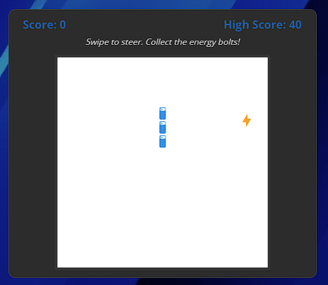
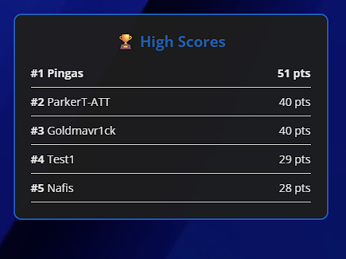

# AT&T Fayetteville Mall Store Portal 📱🚀


## 📖 Overview
The **AT&T Fayetteville Mall Store Portal** is a Progressive Web App (PWA) designed to bridge the gap between physical retail interactions and digital convenience. 

Built to enhance the customer experience while they wait in-store, it also serves as a critical **sales enablement tool** that allows customers to continue their purchasing journey from home while ensuring local store representatives retain credit for the sale.

🔗 **Live Demo:** [att-fayetteville](https://parkrone.github.io/Fayetteville-ATT/)

---

## 🎯 The Value Proposition: Driving Sales & Commission
In the modern retail environment, customers often consult with representatives in-store but prefer to finalize purchases online from the comfort of their homes. Historically, this caused store reps to lose commission on sales they worked hard to close.

**This portal solves that problem:**
1.  **Preserves Commission:** By directing customers to specific, rep-coded purchase links via this portal, we ensure that the employee who consulted the customer gets credit for the sale, even if it happens off-site.
2.  **Reduces Walkouts:** Provides engaging entertainment (Snake Game) and utility (Weather, Music) to reduce perceived wait times during busy hours.
3.  **Instant Information:** Gives customers immediate access to store hours, contact info, and exclusive local deals without needing to flag down an employee for basic FAQs.

---

## ✨ Key Features

### 🛍️ Sales & Utility
* **Smart Store Status:** Automatically detects current time (CST) to display "Open" or "Closed" status with dynamic indicators.
* **Exclusive Deals:** Direct links to Fayetteville-specific AT&T promotions.
* **Direct Contact:** One-tap "Call Store" and "Save Contact" (vCard download) buttons.
* **Review Integration:** Seamless link to Google Maps for customer feedback.

### 🎮 Gamification & Engagement
* **AT&T Snake:** A custom-branded version of the classic game to keep customers entertained while waiting in the queue.
* **Global Leaderboard:** Powered by **Dreamlo**, allowing customers to compete for high scores.
* **Profanity Filter:** A robust, "Riot Games-style" chat filter (using a custom dataset) ensures the leaderboard remains family-friendly and professional.

### 🎨 UI/UX & Atmosphere
* **Dynamic Atmosphere:** Features live weather updates (Open-Meteo API) and "Now Playing" music info (Last.fm API) to match the store's vibe.
* **Responsive Design:** Fully optimized for mobile devices (iPhone/Android) and desktop 360Hz monitors.
* **Progressive Web App (PWA):** Can be installed directly to a user's home screen for an app-like experience.
* **Fluid Animations:** Custom CSS glow effects and "jelly" button interactions for a polished feel.

---

## 📸 Screenshots

| Mobile Interface | Leaderboard & Game |
|:---:|:---:|
|  |  |
| *Clean, touch-friendly mobile navigation* | *Integrated Snake game with live high scores* |

---

## 🛠️ Technical Stack

* **Frontend:** HTML5, CSS3 (Custom Properties, Animations), Vanilla JavaScript (ES6+).
* **APIs:**
    * **Open-Meteo:** For real-time local weather.
    * **Last.fm:** To display the current in-store music track.
    * **Dreamlo:** For backend leaderboard management.
* **Data Handling:** LocalStorage for high-score caching; Fetch API for external datasets (bad word lists).
* **PWA:** Service Workers and Manifest for offline capabilities and installation.

---

## 🚀 Installation & Setup

To run this project locally:

1.  **Clone the repository:**
    ```bash
    git clone [https://github.com/Parkrone/Fayetteville-ATT.git](https://github.com/Parkrone/Fayetteville-ATT.git)
    ```
2.  **Navigate to the directory:**
    ```bash
    cd Fayetteville-ATT
    ```
3.  **Run a local server:**
    Because of CORS policies regarding local file fetching (specifically for the `data/bad-words-comma.txt`), you must run this on a local server (e.g., Live Server in VS Code or Python).
    ```bash
    # Python 3 example
    python -m http.server 8000
    ```
4.  **Open in Browser:**
    Go to `http://localhost:8000`

---

## 🔮 Future Roadmap
* **Rep Selector:** A dropdown menu allowing customers to select their specific sales representative before clicking "Order Online," ensuring precise commission tracking.
* **Appointment Booking:** Direct integration with AT&T's appointment scheduling system.

---

**Built by [Parker Thompson](https://parkrone.github.io/Parker-Design-Lab/)** *© 2025 Fayetteville Mall Store Location*
